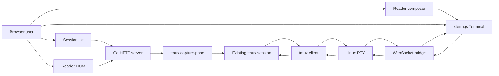

# Reader Mode Technical Design

| Field | Value |
| --- | --- |
| Version | 1.0 |
| Status | Implemented |
| Authors | tmux-webui maintainers |
| Reviewers | TBD |
| Last updated | 2026-08-07 |

## Introduction

tmux-webui is a small, local web entry point for existing tmux sessions. Its purpose is to preserve the current tmux + Codex workflow while making session discovery, reading, copying, and basic input easier in a browser.

The project does not integrate with Codex APIs or manage Codex processes. Codex is treated as any other interactive terminal program. tmux remains the process owner and source of truth, so users can move between a local terminal and the WebUI without changing how sessions are started or kept alive.

Reader mode is the default view. It renders tmux pane history as normal browser text and provides a separate input box. Terminal mode remains available for exact terminal behavior.

## Motivation

A tmux client inside a browser is flexible, but it inherits terminal interaction rules. Selection can conflict with application mouse handling, scrollback feels different from a document, and a full-screen terminal is less comfortable for reading long assistant output.

A pure WebUI process manager would improve the reading experience but would replace the existing tmux lifecycle and reduce interoperability with command-line workflows. It would also require application-specific protocols.

Reader mode keeps tmux and the attached application unchanged while adding a document-like presentation layer.

## Goals

- Discover running tmux sessions, create detached sessions, and show their active paths.
- Preserve existing tmux-owned sessions and processes.
- Render the active pane history as selectable DOM text.
- Support native browser scrolling, selection, copy, and paste into an input box.
- Preserve common ANSI text and background styles without interpreting output as HTML.
- Follow new output only when the user enables Auto-follow.
- Send text, Enter, Escape, Ctrl-C, and Tab to the selected session.
- Keep a complete xterm-based Terminal mode for complex interactive programs.
- Keep all application-facing behavior program-agnostic.
- Remain local-only by default and avoid shell interpolation of session names.

## Non-goals

- Managing Codex threads, turns, models, or app-server state.
- Parsing terminal output into semantic chat messages.
- Replacing tmux as the process supervisor.
- Reproducing cursor placement or full terminal-emulator behavior in Reader mode.
- Supporting multiple panes at once in Reader mode.
- Providing authentication or safe direct public-network exposure.
- Guaranteeing that every full-screen TUI is convenient to control from the Reader input box.

## Terminology

- **Reader**: A document-like DOM rendering of captured tmux pane content.
- **Terminal**: The xterm.js view connected to a real PTY and tmux client.
- **Composer**: The Reader mode text input and send button.
- **Capture**: Text plus SGR attribute sequences returned by `tmux capture-pane` for the selected session's active pane.
- **Session**: A tmux session returned by `tmux list-sessions`.

## System Architecture

Each visible editor opens one WebSocket-backed tmux client for interaction. xterm.js continues to consume output in both views, even when its visual surface is hidden. This keeps terminal modes such as bracketed paste synchronized for Reader input.

Reader content uses a separate polling path. The Go server asks tmux to render its current pane state, and the browser converts the returned text and SGR attributes to normal DOM lines and styled spans. Visible Reader tabs refresh quickly; inactive open Reader tabs refresh every three seconds so their cached DOM is ready before activation without retaining another tmux client.

## Detailed Design

### Session discovery

`GET /api/sessions` calls `tmux list-sessions` with a fixed format. The response includes the session name, active path, window count, attached client count, and last activity time.

The UI supports search by session name or path. Paths wrap naturally and are limited to two lines in session cards and the active-session header.

### Session creation

`POST /api/sessions` accepts a same-origin JSON request containing a session name. The server validates the name, caps and strictly decodes the request body, then runs `tmux new-session -d -P -F <format> -s <name>` without a shell. tmux returns the newly created session metadata in the same format used by session discovery. The UI adds it to the sidebar and opens it immediately. Duplicate names return HTTP 409 without changing the existing session.

The initial window uses tmux's default shell and inherits the tmux command's working directory. No startup command is accepted from the browser.

### Pane capture API

`GET /api/capture?session=<name>` performs these steps:

1. Require a session name.
2. Confirm an exact match against the current tmux session list.
3. Run `tmux capture-pane -p -e -J -S - -t <name>` without a shell.
4. Return UTF-8 text with SGR attribute sequences and `Cache-Control: no-store`.
5. Reject a response larger than 8 MiB.

`-S -` includes available history and the visible pane. `-e` preserves text and background attributes as escape sequences. `-J` joins rows created only by terminal soft wrapping, allowing the browser to wrap the resulting logical line to its own width.

The active pane of the selected session is the capture target. tmux, rather than the browser, remains responsible for applying terminal control sequences and producing the rendered text state.

### Reader rendering

Reader mode polls the capture API approximately every 850 ms. Requests are serialized, so a slow capture cannot create an unbounded queue.

The response is normalized to line feed separators, and empty rows at the end are removed. A limited terminal-sequence parser supports the 16-color palette, 256-color palette, RGB foreground and background colors, common emphasis attributes, and OSC 8 hyperlinks. Only absolute HTTP and HTTPS hyperlink targets become anchors; unsupported OSC controls are stripped. Each logical line becomes a `div` with `white-space: pre-wrap`; style runs become spans. Values are always assigned with `textContent`, so captured output is never interpreted as HTML.

On every refresh, the browser finds the common prefix and suffix between the old and new line arrays. Only the changed middle range is replaced. This preserves stable DOM nodes for most append-only output and makes browser selection less likely to reset.

Reader opens at the latest output, then preserves the viewport as new output arrives. The toolbar Auto-follow option opts into continuous following and is persisted in browser storage.

### Reader input

The Composer is a native textarea. Enter sends its value followed by Enter; Shift+Enter inserts a newline. Empty submission sends Enter. The textarea grows up to 150 pixels.

Text is passed through xterm.js paste handling before Enter is sent. This respects the selected application's bracketed-paste mode. Escape, Ctrl-C, and Tab buttons send their corresponding terminal bytes directly.

Reader mode is intentionally a convenience input surface, not a terminal emulator. Applications that need cursor navigation, function keys, mouse protocols, or precise screen coordinates should use Terminal mode.

### Terminal mode

Terminal mode exposes the existing xterm.js surface. It receives raw PTY bytes, sends keyboard and mouse input, handles resize messages, and provides terminal selection and clipboard actions.

Switching modes does not restart the tmux session. The same WebSocket and PTY connection remains active. When Terminal becomes visible, the fit addon recalculates rows and columns and sends a resize event.

While Reader is visible, the browser estimates terminal dimensions from the Reader viewport. This gives interactive applications a useful screen size even though xterm.js is not displayed.

### Failure behavior

- A missing session produces a clear API error, and its open tabs close after the next successful session refresh confirms that it ended.
- A capture failure leaves existing Reader content in place. If no content has loaded, the UI shows `Output unavailable`.
- A closed WebSocket disables effective input and produces `Not connected` when the user tries to send.
- Reader polling for all open tabs resumes after the page becomes visible again.
- Reconnect creates a new tmux client but does not terminate the underlying session.

### Security and privacy

The service has the same effective access as the Unix user that runs it. Pane captures may contain sensitive terminal history.

The server listens on loopback by default, requires explicit opt-in for non-loopback binding, checks WebSocket origin, and applies restrictive browser security headers. Session names are passed as individual process arguments and never evaluated by a shell.

This project does not provide authentication. Remote access should use an authenticated tunnel or reverse proxy with TLS.

## Compatibility

Reader mode is additive:

- Existing tmux sessions do not need to be changed or restarted.
- Codex may continue to be launched inside tmux by any existing script or command.
- Local tmux clients and the WebUI may attach to the same session.
- Terminal mode remains the behavioral fallback for unsupported Reader interactions.
- Disabling or removing the capture endpoint does not affect the PTY/WebSocket path.

The implementation targets Linux because the PTY bridge uses Linux-specific APIs. It requires a tmux version that supports the used `capture-pane` flags.

## Testing Strategy

### Automated checks

- Go unit tests cover tmux session parsing, exact argument preservation, WebSocket framing, origin checks, dimensions, and PTY helpers.
- `go test ./...` verifies that the embedded production assets and server packages build together.
- `npm run build` verifies the Reader and Terminal frontend bundle.

### Manual checks

- Load real local sessions through `/api/sessions`.
- Capture a live session through `/api/capture` without exposing its content in test logs.
- Confirm the production HTML contains the Reader/Terminal switch and Composer.
- In a browser, verify selection remains usable while output updates.
- Scroll upward and confirm new output does not force the viewport to the bottom.
- Submit text, multiline paste, Enter, Escape, Ctrl-C, and Tab.
- Switch to Terminal and verify resize, keyboard, mouse, copy, and paste.
- Disconnect the WebSocket and verify visible failure behavior.

## Rollout and Rollback

The feature ships in the existing single binary because frontend assets are embedded. Reader is the default, with Terminal one click away.

Rollout can start with localhost-only use against disposable or non-sensitive sessions. Broader use should follow after checking capture cost and selection stability on long-lived sessions.

Rollback is low risk: switch to Terminal in the UI, or revert the Reader frontend and capture endpoint. tmux sessions remain independent of the WebUI in either case.

## Risks and Mitigations

| Risk | Impact | Mitigation |
| --- | --- | --- |
| Frequent full-history capture uses CPU and memory | Large histories may make polling expensive | Serialize requests, pause while hidden, cap responses, and keep the polling interval modest |
| Reader does not implement every terminal control sequence or screen coordinate | Some output is less expressive or ambiguous | Parse only bounded SGR attributes and retain Terminal mode |
| Capture updates replace selected DOM nodes | Browser selection may reset near changing lines | Reuse the common prefix and suffix; disable auto-follow by default |
| Reader input cannot express all terminal actions | Complex TUI workflows may be blocked | Provide common control keys and a one-click Terminal fallback |
| A WebUI client changes tmux dimensions | Other attached clients may see a resize | Fit to the active view and keep Reader dimensions within practical bounds |
| Pane history contains secrets | Browser or proxy exposure could leak data | Loopback default, no-store responses, origin checks, and explicit remote-access warnings |
| Session active pane changes | Reader content changes unexpectedly | Treat tmux active-pane state as authoritative and show the selected session clearly |

## Alternatives Considered

### xterm.js only

This is the simplest and most accurate terminal representation, and remains available as Terminal mode. It does not provide the desired document-like scrolling and native text interaction.

### Codex app-server integration

An application protocol could expose structured turns and richer controls. It would no longer be generic, would not automatically manage already-running terminal programs, and would weaken compatibility with the current tmux workflow.

### Parse the live PTY stream into a second terminal model

The browser already does this for Terminal mode, but alternate-screen buffers and terminal scrollback do not reliably represent the full tmux pane history. Asking tmux to capture its rendered state is more faithful to the existing session.

### Server-pushed capture deltas

Streaming diffs could reduce polling overhead, but the server would need per-client state, resynchronization, and backpressure. Full capture polling is smaller and easier to reason about for this local tool.

### Full terminal emulation in Reader

Running each capture through another terminal emulator could reproduce more control sequences and screen behavior, but would add a second stateful terminal model and weaken native document interaction. Reader instead recognizes only SGR attributes emitted by `capture-pane -e`, builds styles from an allowlisted state model, and inserts all captured characters with `textContent`.

## Unresolved Questions

- Should capture polling adapt to output activity and history size?
- Should the target include an explicit window and pane selector?
- Should users be able to pin Reader terminal dimensions per session?
- Is a server-side capture cache useful when several browser tabs watch the same pane?

## Working Issues

| Issue | Owner | Status |
| --- | --- | --- |
| Validate selection stability on very long, rapidly updating sessions | Maintainers | Follow-up |
| Measure capture cost near the 8 MiB limit | Maintainers | Follow-up |
| Test multiple attached clients with different dimensions | Maintainers | Follow-up |

## Review

Review should focus on three boundaries:

1. tmux remains the process owner and source of truth.
2. Reader is a convenience layer, while Terminal preserves full interaction.
3. The project stays program-agnostic and local-only by default.

Approval should include backend safety, browser selection behavior, input correctness, capture performance, and rollback simplicity.
